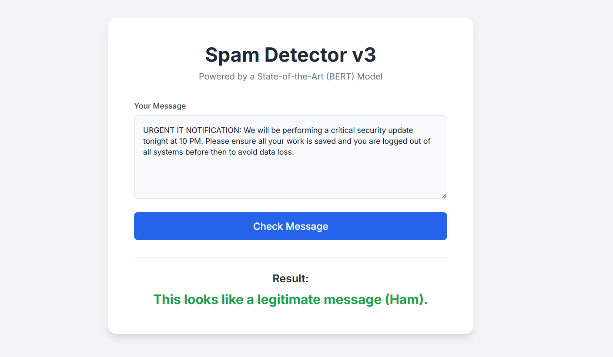
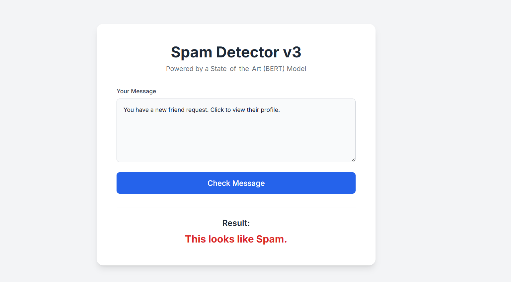

# Final Spam Message Detector 📧

This repository contains the Jupyter Notebook and associated files for building and fine-tuning a sophisticated spam message detector. The project leverages a state-of-the-art Natural Language Processing (NLP) model to accurately classify SMS messages as either "Spam" or "Legitimate" (Ham).

The core of this project is the `Spam_message_detector.ipynb` notebook, which walks through the entire process from data loading to model training and evaluation.

---

## 🧐 Project Goal

The primary objective was to fine-tune a transformer-based model (like BERT) to understand the nuances and context of modern text messages, leading to a higher accuracy than traditional keyword-based filters. A key challenge addressed was minimizing false positives, ensuring that important legitimate messages are not incorrectly flagged as spam.

### Example Classifications

Below are examples of the types of messages the model is trained to differentiate.

| Legitimate Message (Ham) | Spam Message |
| :---: | :---: |
|  |  |


---

## 🛠️ Technology Stack

* **Language**: **Python**
* **Core Libraries**: **Pandas**, **Scikit-learn**
* **NLP/Deep Learning**: **PyTorch**, **Hugging Face Transformers**
* **Environment**: **Jupyter Notebook**

---

## 📖 The Notebook: `Spam_message_detector.ipynb`

The notebook is structured to cover the complete machine learning workflow:

1.  **Setup & Installation**: Imports and installs all necessary libraries.
2.  **Data Loading & Augmentation**: Loads the classic UCI SMS Spam Collection dataset and enhances it with custom, modern examples of spam and ham to improve real-world performance.
3.  **Model Fine-Tuning**: A pre-trained transformer model from Hugging Face is fine-tuned on the combined dataset. This step adapts the general-purpose language model to become a specialist in spam detection.
4.  **Evaluation**: The model's performance is assessed to ensure high accuracy and precision.

---

## 🚀 How to Run this Project

To explore the notebook and run the code on your own machine, follow these steps:

1.  **Clone the repository:**
    ```bash
    git clone [https://github.com/Harsha-SankaraSetty/spam-detector-final.git](https://github.com/Harsha-SankaraSetty/spam-detector-final.git)
    cd spam-detector-final
    ```

2.  **Create and activate a virtual environment:**
    ```bash
    # For macOS/Linux
    python3 -m venv venv
    source venv/bin/activate

    # For Windows
    python -m venv venv
    .\venv\Scripts\activate
    ```

3.  **Install the required dependencies:**
    *(Note: Your requirements file is named `requirements`, you may need to rename it to `requirements.txt` for this command to work)*
    ```bash
    pip install -r requirements.txt
    ```

4.  **Launch Jupyter Notebook:**
    ```bash
    jupyter notebook
    ```
    Then, open the `Spam_message_detector.ipynb` file and run the cells.

    **Note**: The model training cells require a significant amount of computation. It is highly recommended to run this notebook in an environment with access to a **GPU**, such as Google Colab or Kaggle Kernels.

---
## Acknowledgments
-   This project uses the [SMS Spam Collection Data Set](https://archive.ics.uci.edu/ml/datasets/sms+spam+collection) from the UCI Machine Learning Repository.
